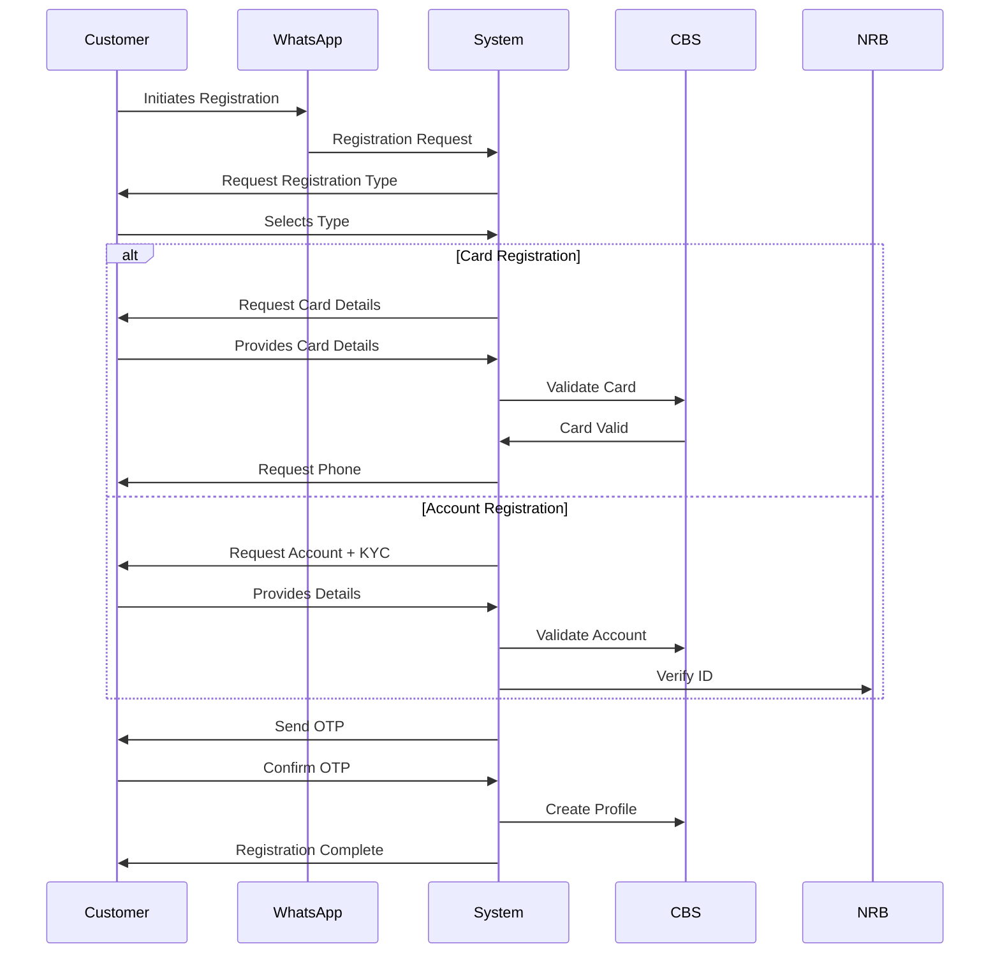
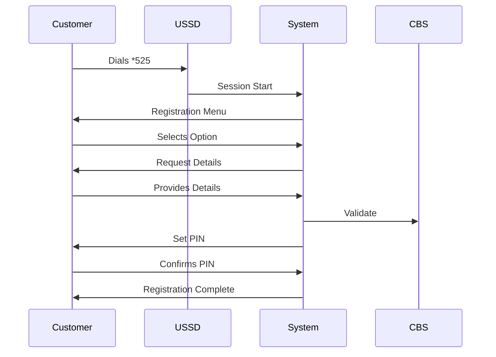

# Social Banking System Architecture Document

## 1. System Overview

### 1.1 Channels
- WhatsApp Business API Integration
- USSD Gateway Integration

### 1.2 Core Dependencies
1. API Integrations Required:
   - WhatsApp Business API
   - USSD Gateway Provider API
   - Core Banking System (T24) API
   - Mobile Money APIs
     * Airtel Money API
     * TNM Mpamba API
   - Bill Payment Provider APIs
     * Electricity Provider API
     * Water Utility API
     * TV Service Provider API
   - National ID Verification API
   - SMS Gateway API (for OTPs)
   - Email Service API (for statements)

2. Third-Party Services:
   - OTP Generation Service
   - PIN Encryption Service
   - Transaction Monitoring System
   - Fraud Detection System

### 1.3 System Components
1. Message Handler
   - WhatsApp Message Processor
   - USSD Message Processor
   
2. Authentication Service
   - OTP Generator & Validator
   - PIN Manager
   - Session Manager

3. Transaction Processor
   - Transaction Queue Manager
   - Transaction Logger
   - Reconciliation Service

4. Security Layer
   - Encryption Service
   - Fraud Detection
   - Rate Limiter

## 2. Complete Menu Structure

### 2.1 Main Menu
1. Registration & Onboarding
2. Account Services
3. Money Transfer
4. Payments
5. Statements & History
6. Settings & Support

### 2.2 Detailed Menu Breakdown
```
1. Registration & Onboarding
   ├── Card Registration
   │   ├── Card Validation
   │   ├── Phone Verification
   │   └── Profile Creation
   │
   └── Account Registration
       ├── Account Validation
       ├── KYC Verification
       └── Profile Creation

2. Account Services
   ├── Balance Inquiry
   ├── Mini Statement
   ├── Full Statement
   └── Account Details

3. Money Transfer
   ├── Internal Transfer (FDH)
   ├── Other Bank Transfer
   ├── Mobile Money Transfer
   └── Scheduled Transfer

4. Payments
   ├── Bill Payments
   │   ├── Electricity
   │   ├── Water
   │   ├── TV
   │   └── Other
   │
   └── Airtime Purchase
       ├── Self
       └── Others

5. Statements & History
   ├── Mini Statement
   ├── Full Statement
   └── Transaction Status

6. Settings & Support
    ├── Language Settings
    ├── Help
    ├── Support Contact
    └── Security Settings
```

## 3. Module-by-Module Implementation

### 3.1 Registration Module

#### WhatsApp Flow


#### USSD Flow


### 3.2 Transfer Module

#### Data Requirements
```json
{
    "transfer": {
        "sender": {
            "accountNumber": "string",
            "accountType": "string",
            "currency": "string"
        },
        "recipient": {
            "accountNumber": "string",
            "bankCode": "string",
            "accountName": "string"
        },
        "amount": "decimal",
        "reference": "string",
        "transferType": "string"
    }
}
```

#### Implementation Requirements
1. Input Validation
   - Account number format
   - Amount limits
   - Daily transaction limits
   - Blacklist checking

2. Security Checks
   - OTP validation
   - Fraud detection
   - Amount limit validation

3. Error Handling
   - Insufficient funds
   - Invalid account
   - System timeout
   - Network failure

### 3.3 Bill Payment Module

#### Service Integration Requirements
1. Electricity
   ```json
   {
       "serviceCode": "ELEC",
       "meterNumber": "string",
       "accountNumber": "string",
       "amount": "decimal"
   }
   ```

2. Water
   ```json
   {
       "serviceCode": "WATER",
       "accountNumber": "string",
       "amount": "decimal"
   }
   ```

#### Implementation Flow
1. Service Selection
2. Number Validation
3. Amount Confirmation
4. Payment Processing
5. Receipt Generation

### 3.4 Security Implementation

#### Session Management
1. WhatsApp
   - OTP validity: 5 minutes
   - Session timeout: 5 minutes
   - Max attempts: 3

2. USSD
   - PIN attempts: 3
   - Session timeout: 2 minutes
   - Screen timeout: 30 seconds

#### Transaction Security
1. Input Validation
   - Account number format
   - Amount limits
   - Special character filtering

2. Rate Limiting
   - Max transactions per minute
   - Max OTP requests
   - Max failed attempts

## 4. Error Handling

### 4.1 Standard Error Codes
```json
{
    "errors": {
        "AUTH001": "Invalid OTP",
        "AUTH002": "Session Expired",
        "TRANS001": "Insufficient Funds",
        "TRANS002": "Invalid Account",
        "SYS001": "System Unavailable"
    }
}
```

### 4.2 Error Messages
- WhatsApp: Full detailed messages
- USSD: Short codes with brief messages

## 5. Testing Requirements

### 5.1 Test Cases Categories
1. Registration Flows
2. Transaction Processing
3. Security Validation
4. Error Handling
5. Integration Tests
6. Load Testing

### 5.2 Test Environment Requirements
- Sandbox environments for all APIs
- Test accounts in CBS
- Test mobile money accounts
- Test bill payment accounts

## 6. Monitoring & Logging

### 6.1 Transaction Logging
```json
{
    "transactionLog": {
        "sessionId": "string",
        "channel": "string",
        "transactionType": "string",
        "timestamp": "datetime",
        "status": "string",
        "errorCode": "string"
    }
}
```

### 6.2 Performance Metrics
1. Response Times
2. Success Rates
3. Error Rates
4. Session Duration
5. Transaction Volume

## 7. Deployment Requirements

### 7.1 Infrastructure
1. Load Balancers
2. Application Servers
3. Database Servers
4. Message Queues
5. Cache Servers

### 7.2 Security Requirements
1. SSL/TLS Encryption
2. API Gateway
3. Firewall Configuration
4. DDoS Protection
5. Data Encryption
